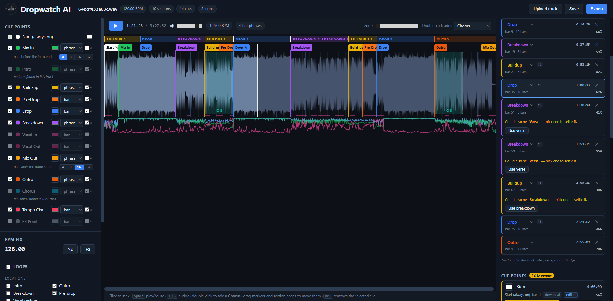
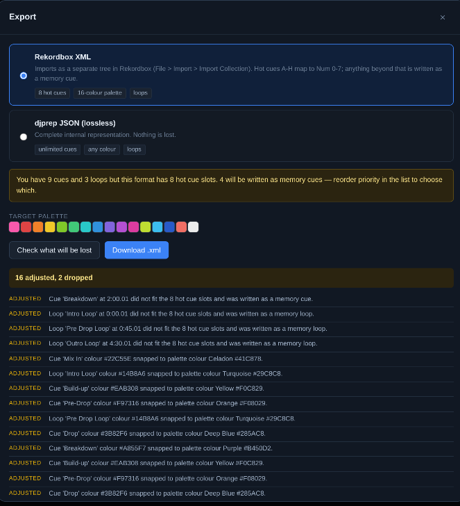

# Dropwatch AI

Analyses a track, proposes cue points and loops **with reasons**, lets you edit
everything, and exports to Rekordbox. The AI prepares; the DJ decides.

**Beat grid:** Fits a *parametric* constant-tempo grid (bpm, phase) rather than
tracking individual beats, by comb-filtering the onset envelope over a fine
(tempo, phase) lattice. Club music is machine-quantised, DJ software stores grids
this way, and a parametric fit cannot be derailed by one mis-detected beat in a
breakdown. The anchor is then pulled onto the true transient by coherently
averaging a window around every predicted beat; roughly a 25x SNR improvement on
the attack, giving sub-10 ms placement.

**Downbeats:** Which beat is bar-one is a 4-way classification, not tracking. The
obvious cue of "the downbeat being the loudest beat" is *actively wrong* for most
dance and pop music, because the snare sits on beats 2 and 4. Four bar-rate cues
are combined instead: low-band flux (bass re-entering), inter-bar chroma
coherence, arrangement-change alignment, and bass-note-change alignment.

**Phrases:** Phrase levels nest; every 16-bar boundary is also an 8-bar boundary, 
so the estimator descends the metrical hierarchy, subdividing only while the
finer level's *unique* boundaries are significantly more novel than ordinary bars
(one-sided Mann-Whitney U, p < 0.05). Rank-based, so it needs no tuned threshold.

**Sections:** Self-similarity matrix over delay-embedded beat-synchronous
features -> Foote novelty -> boundaries **snapped to the phrase grid** -> merged ->
labelled. Labelling is interpretable rules producing emission scores, decoded by
a Viterbi pass over an arrangement grammar, so an isolated loud segment inside a
breakdown is not called a drop.

**Cues and loops:** Per-type detectors emit candidates carrying evidence; a
logistic model turns evidence into a calibrated confidence *and* the displayed
explanation, because each reason's weight is literally its term in the logit.
Loops are scored on **seamlessness**; how similar the loop is to the material
that follows it, i.e. "will this sound like the track continuing when it repeats".

**Every track gets a load cue**, every repeated section is marked (three drops
means three drop cues), and mix-in / mix-out are anchored to section boundaries
with a selectable 4/8/16/32-bar offset, clamped to whatever the section can
actually give and told to you when clamped.

**Tempo changes** are detected separately from the main grid fit, which assumes a
constant tempo. Where that assumption breaks, you get a marker rather than a
silently averaged tempo that fits neither half.

**Labels you can't trust aren't shown.** Verse, chorus and bridge are pop-vocal
distinctions; on an instrumental they're not hard to detect, they're *absent*, so
they're gated on real vocal evidence. Close calls (usually drop vs chorus) 
are flagged in place with the runner-up named, and one click settles them.
Everything you edit is marked yours and survives re-analysis.

**Export:** The internal model knows nothing about Rekordbox: no hot-cue slots,
no palette indices, no Num. Translation is an explicit *lowering pass* that
emits a report of every concession; colours snapped, cues demoted to memory
cues, explanations that the format cannot carry.

## Measured on the synthetic fixture

| | |
|---|---|
| BPM | exact (128.000) |
| Grid anchor | 6.8 ms |
| Downbeat phase | correct, 95% confidence |
| Phrase length + phase | 8 bars, phase 0, exact |
| Section boundary F1 | 1.00 at half-bar tolerance |
| Frame label accuracy | 99.5% |
| Vocal detection F1 | 0.91 (P 1.00 / R 0.84) |
| Cue placement error | 0.004 bars median |
| Tempo-change detection | 1/1 found, 0 false positives |
| Analysis time | ~12 s for a 5-minute track |
| Re-recommend after a config change | ~40 ms |
| BPM ×2 / ÷2 correction | ~0.3 s (reuses cached features) |
| Tests | 115 passing |

The fixture is synthetic and these numbers will not survive contact with real
music. `docs/EVALUATION.md` explains how to find out what they really are.

## Documentation

- [`docs/ARCHITECTURE.md`](docs/ARCHITECTURE.md) - components, data flow, why the seams are where they are
- [`docs/ALGORITHMS.md`](docs/ALGORITHMS.md) - every detector, and the bugs that shaped them
- [`docs/EVALUATION.md`](docs/EVALUATION.md) - how to tell whether the recommendations are good
- [`docs/ROADMAP.md`](docs/ROADMAP.md) - MVP - intermediate - advanced, and what to cut